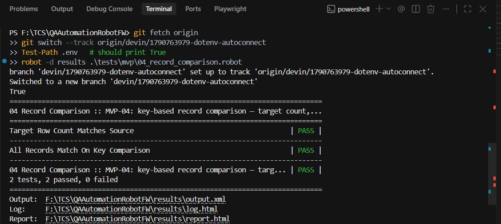
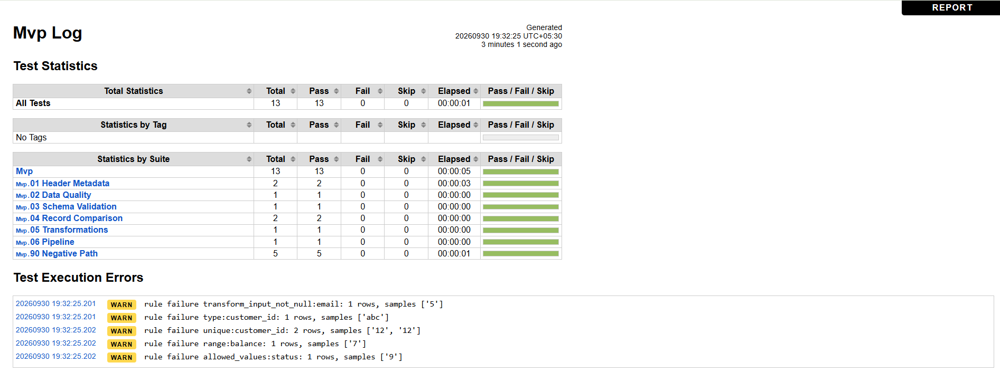
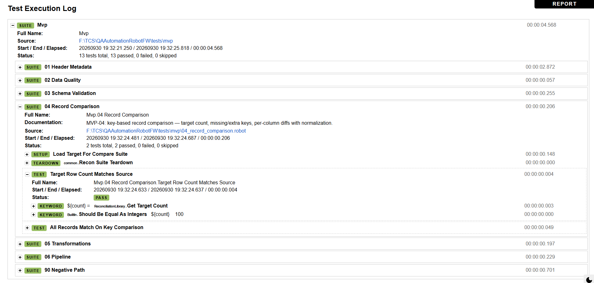
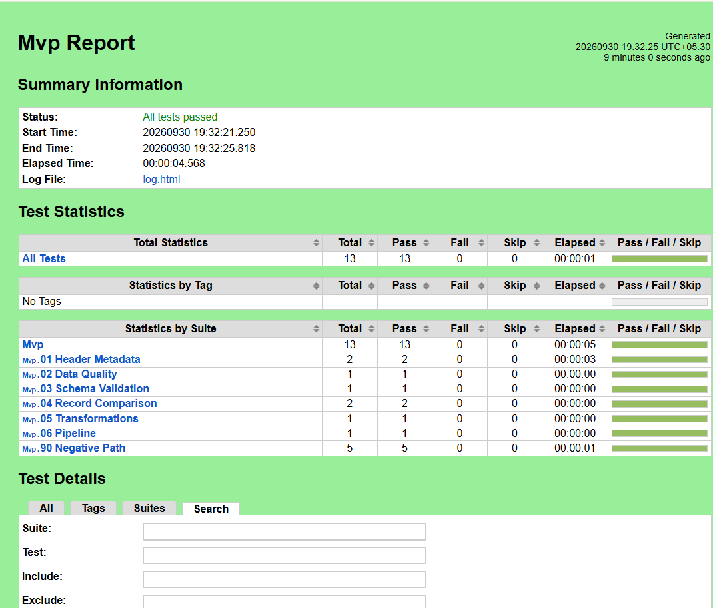

# QA Guide — Data Reconciliation Testing Framework

**Audience:** QA team. **Goal:** understand what this does, how to run it, and
where to read results — no deep technical background needed.

---

## 1. What it does, in one paragraph

Whenever data moves from a source file into a database, this framework answers
*“did everything arrive correctly?”* — automatically. Instead of comparing
spreadsheets by hand, one test run validates the file, loads it into the
database, and checks every record, column by column, against a **data contract**
(a YAML file that defines what the data *should* look like).

Every run reports five facts:

| Metric | Meaning |
| --- | --- |
| Target count | Records actually loaded into the database |
| Mismatch count | Records that differ between source and database |
| Validation rule failures | Data-quality rule violations (bad types, out-of-range, duplicates, …) |
| Environment | Which environment the run hit (`dev` / `test` / `prod_read`) |
| Final status | **PASS** or **FAIL** |

These land in `results/run_summary.json` and the Robot HTML reports.

---

## 2. How it works (30-second picture)

```
customer.csv  ──►  pre-load checks        ──►  loader (recon_rw)  ──►  PostgreSQL
 (source)         header · metadata ·           (contract-driven)      (target)
                  data-quality rules                                        │
                                      ◄── post-load checks ───────────────┘
                                      schema vs contract
                                      key-by-key record compare
                                      transform re-computation
                                              │
                                              ▼
                              report.html / log.html / run_summary.json
```

The **contract** (`config/contracts/customer.yaml`) is the single source of
truth: column names, types, nullability, allowed values, keys, and the
transformations that should be applied (e.g. *email → lowercase*,
*`first_name + last_name → full_name`*). Tests contain **zero hardcoded column
logic** — change the contract and the validation follows.

### Safety model (important for prod readiness)

| Role | Used for | Rights |
| --- | --- | --- |
| `recon_rw` | Loader only | INSERT/UPDATE/DELETE/TRUNCATE on the recon tables |
| `recon_ro` | All verification queries | **SELECT only** — read-only enforced at the DB role level |

Local credentials live in a git-ignored `.env` file; CI supplies them through
environment variables / GitHub secrets. Never commit real passwords.

---

## 3. When do the tests run?

| Trigger | Where | Who does it |
| --- | --- | --- |
| Every **push** to `main` | GitHub Actions | automatic |
| Every **pull request** | GitHub Actions | automatic |
| **Nightly** at 02:00 UTC | GitHub Actions (schedule) | automatic |
| On demand | Any engineer's machine / IDE | `robot -d results tests/pilot` |

A QA engineer never needs to trigger anything for routine coverage — merges and
the nightly run handle it. To run a specific check manually (e.g. a new data
drop), see §4.

---

## 4. How to run it yourself (PowerShell)

Run these commands from the repository root, with PostgreSQL `recon` running on
`localhost:5432` and the `recon_ro` / `recon_rw` roles already created.

### Get the version that loads `.env`

The automatic `.env` loading is in
[PR #1](https://github.com/murugangeek-vp/RobotFWDevinAIQA/pull/1).
Until that PR is merged, use its branch. Check for local changes before
switching; an empty `git status --short` means your tracked files are clean:

```powershell
git status --short
git fetch origin
git switch --track origin/devin/1790763979-dotenv-autoconnect
```

If the branch already exists locally, run
`git switch devin/1790763979-dotenv-autoconnect` instead of `git switch --track`.
After the PR is merged, you can run `git switch main` and `git pull origin main`
to get this change on main.

### Set up once

If Python dependencies are not installed yet, create the virtual environment
once. Skip these commands if `.venv` is already set up:

```powershell
python -m venv .venv
.\.venv\Scripts\python.exe -m pip install -r requirements.txt
```

Create the git-ignored credentials file in the repository root and replace both
password placeholders with the existing PostgreSQL role passwords:

```powershell
Copy-Item .env.example .env
notepad .env
Test-Path .env   # should print True
```

Variables already set in the shell/CI take precedence over `.env`.
Copy the file only once; subsequent runs use it automatically.

The file must contain all four keys (with real passwords in place of these
placeholders):

```text
RECON_RO_USER=recon_ro
RECON_RO_PASSWORD=<your RO role password>
RECON_RW_USER=recon_rw
RECON_RW_PASSWORD=<your RW role password>
```

Keep `.env` private. The library reads it on suite setup; no PowerShell
password assignments or repeated installs are needed. Existing shell or CI
environment variables take precedence over `.env`.

### Run tests

Use the virtual environment's Robot executable directly; no activation is
required. Each command works in a new PowerShell terminal from the repo root:

```powershell
# Full suite
.\.venv\Scripts\robot.exe -d results .\tests\pilot

# One suite (record comparison)
.\.venv\Scripts\robot.exe -d results .\tests\pilot\04_record_comparison.robot

# Two or more suites
.\.venv\Scripts\robot.exe -d results .\tests\pilot\01_header_metadata.robot .\tests\pilot\04_record_comparison.robot

# One named test case
.\.venv\Scripts\robot.exe -d results --test "No Records Missing In Target" .\tests\pilot\04_record_comparison.robot

# Multiple named test cases
.\.venv\Scripts\robot.exe -d results --test "Header Matches Contract" --test "File Metadata Matches Contract" .\tests\pilot\01_header_metadata.robot

# End-to-end pipeline
.\.venv\Scripts\robot.exe -d results .\tests\pilot\06_pipeline.robot

# Different source file
.\.venv\Scripts\robot.exe -d results -v SOURCE_FILE:data/samples/customer.csv .\tests\pilot
```

If a run still says `missing env vars RECON_RW_USER / RECON_RW_PASSWORD`, the
checkout is running the old library: verify the branch above. If it instead
says `Set RECON_RW_USER / RECON_RW_PASSWORD in the environment or the repo-root
.env file`, check that `.env` is in this repository's root and contains both RW
keys. Suite 04 loads data with `recon_rw` before comparing with `recon_ro`.

Swap `-v ENV_FILE:config/environments/test.yaml` to point at another environment.





### Expected outcomes

- **Clean data** → all suites PASS, exit code 0.
- **Corrupted data** → FAIL with an *exact* diagnosis on the specific rule-type
  test, e.g. `02_data_quality` reports:

  ```
  6 rule failures: type:customer_id (1 row, ['abc']),
                   unique:customer_id (2 rows, ['12','12']),
                   range:balance, allowed_values:status,
                   transform_input_not_null:email, not_null:email
  ```

  Each failure names the rule, the column, the affected row count, and sample
  key values. Constraints on derived columns (e.g. the `email` regex) are
  checked on the post-transform values too — a malformed input can't hide
  behind a transform.

`tests/pilot/90_negative_path.robot` is a built-in proof: it deliberately seeds
defects (missing record, wrong transformation, bad data) and asserts the
framework catches each one with the exact count. Run it in a demo to show
detection working live.

---

## 5. Where to see the results

### On your machine

Open in a browser after a run:

| File | What it shows |
| --- | --- |
| `results/report.html` | One-page summary: suites, tests, PASS/FAIL, timings |
| `results/log.html` | Drill-down: every keyword step, inputs, messages, failure details |
| `results/run_summary.json` | The five headline metrics as data (for dashboards) |

### In CI (GitHub)

1. Repo → **Actions** tab → pick the workflow run.
2. Job page shows pass/fail and console output.
3. Scroll to **Artifacts** → download `robot-reports.zip` → contains
   `report.html`, `log.html`, `output.xml`, `run_summary.json` — same reports as local.
4. Artifacts are uploaded even when tests fail (`if: always()`).

### Reading a failure fast

| Where it failed | Likely layer | First thing to check |
| --- | --- | --- |
| `01_header_metadata` | Source extract | Column names/order in the file vs contract |
| `02_data_quality` | Source data | `rule_id` + `samples` in the failure message |
| `03_schema_validation` | Target schema | Column type/nullability/PK drift in the DB |
| `04_record_comparison` | Load | `missing_in_target` / `extra_in_target` key lists |
| `05_transformations` | Mapping logic | `Get Transform Diffs` output — column, expected, actual |
| `06_pipeline` | Whole flow | Read earlier failures first; pipeline is the summary |

---

## 6. The suites, in QA terms

| Suite | Answers |
| --- | --- |
| `01_header_metadata` | Is this file the shape we agreed on? Non-empty, right columns, right count? |
| `02_data_quality` | Is the incoming data itself clean? One test per contract rule type: not-null, type, length, range, allowed values, regex, unique, transform inputs |
| `03_schema_validation` | Does the target table still match the contract? Separate results for columns, types, nullability, primary key |
| `04_record_comparison` | Did every record arrive? Separate results for row count, missing keys, extra keys, per-column value diffs |
| `05_transformations` | Did every derivation/mapping compute correctly? One test per transform column |
| `06_pipeline` | The whole flow end-to-end — release gate + loader completeness, audit summary, reload idempotency |
| `90_negative_path` | Self-test: proves detection works and that `recon_ro` cannot write (safe to run anytime) |

---

## 7. FAQ

**Do I need to write code to test a new feed?**
No — publish a new contract YAML + sample file, and the same suites apply. New
contracts get tests in the same sprint (process rule X-02).

**Can the tests write to a production DB?**
No. Verification connects as `recon_ro` (SELECT-only role, enforced by the DB),
and the only write path is the loader as `recon_rw` — which the suites use only
to prepare the test table.

**What if the DB or Docker isn't up?**
`Load Target From Source` fails fast with a connection error — no silent skips.

**How do we demo it?**
Run `robot -d results tests/pilot` → open `results/report.html`. Then run
`90_negative_path.robot` to show seeded defects being caught and counted.
